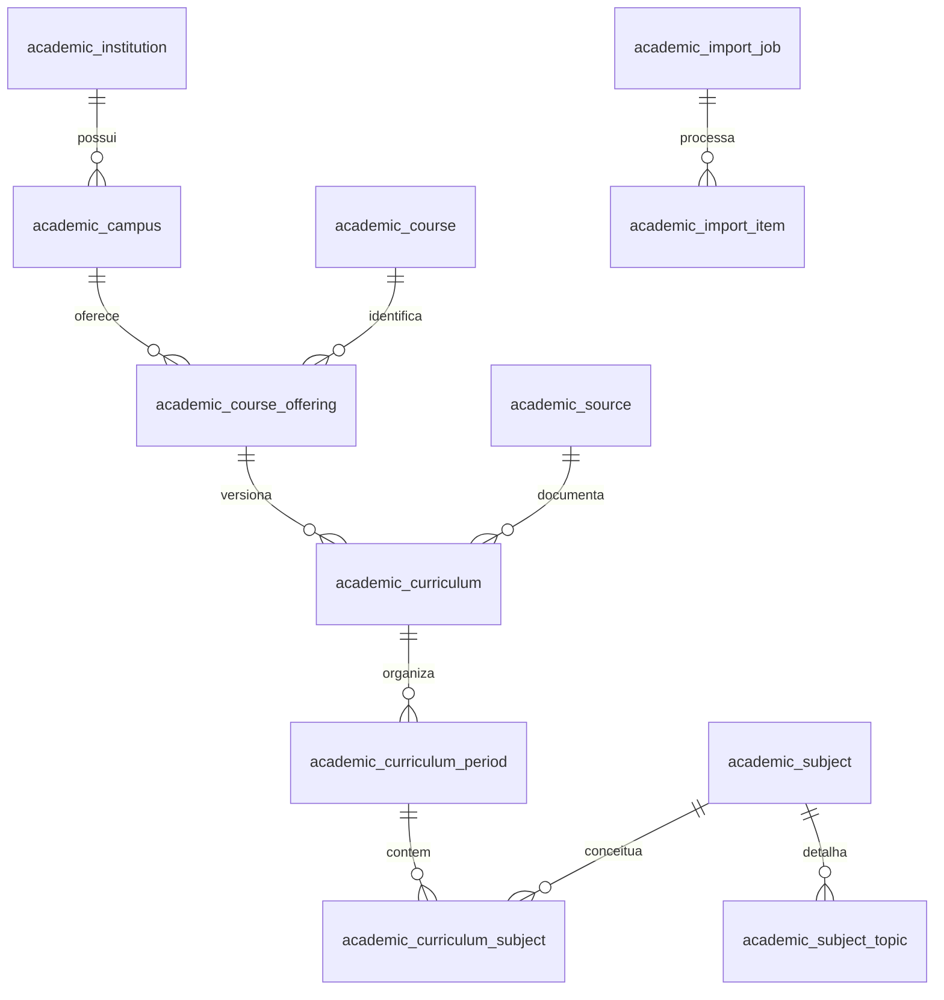

# Modelo acadêmico

`academic_entry` permanece como projeção de compatibilidade com os mesmos UUIDs. A migration V6 cria tabelas normalizadas e um trigger transacional para manter os dois modelos consistentes; imports legados continuam funcionando. Não remove matrículas, salas, mensagens ou caronas.

Disciplinas conceituais e ocorrências de grade são distintas. Sem comprovação de equivalência, cada ocorrência mantém seu próprio conceito. `attributes.subjectId` ou `courseId` permite associação explícita a um conceito existente; sem fusão automática por semelhança de nome. Cursos/modalidades UNA que o mesmo documento oficial identifica como o mesmo curso compartilham conceito.

Chave externa: provider + tipo + externalId, exposta em `academic_external_identity`; chave única e UUID determinístico garantem idempotência. Fontes têm SHA-256, data de coleta, data de verificação, tipo, URL, provider e status. Registros legados sem hash mantêm essa lacuna explícita, sem hash inventado.

FKs compostas impedem períodos/disciplinas/pré-requisitos de outra grade. O serviço rejeita ciclos de pré-requisitos. Nome, período, estrutura, carga horária e pré-requisitos de uma grade publicada exigem novos identificadores e versão. Status antigos não são apagados. Identidades externas são próprias do provider; associação entre instituições de providers diferentes exige revisão da chave e-MEC.

V6 preenche `academic_enrollment.course_offering_id/curriculum_id` e preserva `period_id`. Salas mantêm `subject_id` da ocorrência e recebem `canonical_subject_id` e escopo `CURRICULUM`; matching global não é ativado automaticamente. Troca de período gera `academic_enrollment_history` com o contexto anterior. V7 adiciona progresso dos jogos separado dos dados acadêmicos.

`academic_migration_report` registra contagens de backfill; a migration inteira falha se um vínculo não puder ser migrado. Índices cobrem hierarquia, provider/identidade, normalização, fila e auditoria. A função imutável `academic_normalize` dispensa extensões PostgreSQL. Pesquisa parcial ainda usa LIKE e deve ser medida antes de adicionar índices especializados para escala nacional.

Backup antes de produção: use snapshot do PostgreSQL. A reversão da aplicação pode manter V6/V7, compatíveis com o modelo anterior; não executar DROP de tabelas para rollback.
