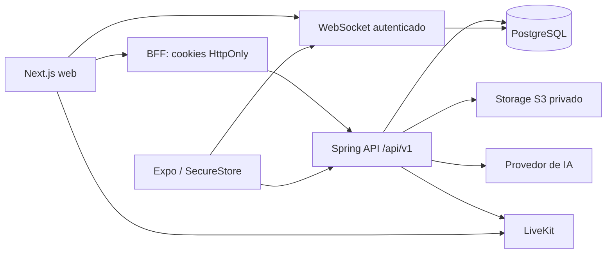

# Arquitetura

Monólito modular Java 21, Spring Boot 3.5, PostgreSQL, Flyway. Autenticação de usuários usa entidades JPA/repositórios; consultas transacionais de catálogo, salas e caronas usam JDBC parametrizado para tornar explícitos os locks e limites de autorização. Não são expostas entidades JPA nos controllers.

Módulos: auth emite e revoga sessões; academics mantém a árvore curricular; users gerencia matrícula; study controla salas/participantes; chat exige associação; voice fornece grants de áudio; materials valida e armazena documentos; ai recupera chunks apenas da sala; rides controla interesse/aceite; moderation aplica bloqueios e ações auditáveis. As dependências partem dos módulos consumidores para auth/common/study, sem dependência inversa do domínio para controllers ou SDKs.

Fronteiras externas: ObjectStorageService, VoiceProvider e AiProvider. EmailWorker processa outbox durável; envio SMTP ocorre após o commit que criou a conta. PushNotificationService, OAuth, filas de parsing e embeddings são extensões ainda não implementadas.

Tokens opacos foram escolhidos em vez de JWT para a API: cada chamada consulta a sessão, permitindo revogação imediata. JWT é usado exclusivamente no grant LiveKit. A infraestrutura inicial não depende de Redis. O WebSocket consulta snapshots limitados no banco a cada 1,5 s; antes de aumentar a escala, substituir a sondagem por eventos/outbox + Redis pub/sub e medir carga.

O catálogo usa `academic_entry`, com tipos explícitos e hierarquia imutável: instituição → campus → curso → versão curricular → período → disciplina → tópico. A versão inicial representa ofertas de disciplina dentro da grade. Identidade canônica de disciplinas reutilizáveis em múltiplas grades e pré-requisitos ainda precisam de modelagem adicional.
