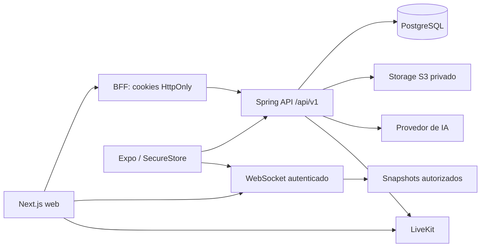

# Arquitetura

Monólito modular Java 21, Spring Boot 3.5, PostgreSQL, Flyway. Autenticação de usuários usa entidades JPA/repositórios; consultas transacionais de catálogo, salas e caronas usam JDBC parametrizado para tornar explícitos os locks e limites de autorização. Não são expostas entidades JPA nos controllers.

Módulos: auth emite e revoga sessões; academics mantém a árvore curricular; users gerencia matrícula; study controla salas/participantes; chat valida associação e persiste mensagens e anexos; voice fornece grants LiveKit para voz/câmera/tela; materials valida e armazena documentos; ai recupera chunks apenas da sala e integra a OpenAI Responses API; rides controla interesse/aceite; moderation aplica bloqueios e ações auditáveis. As dependências partem dos módulos consumidores para auth/common/study, sem dependência inversa do domínio para controllers ou SDKs.

Fronteiras externas: ObjectStorageService, VoiceProvider e AiProvider. EmailWorker processa outbox durável; envio SMTP ocorre após o commit que criou a conta. PushNotificationService, OAuth, filas de parsing e embeddings são extensões ainda não implementadas.

Tokens opacos permitem revogação imediata das sessões API. JWT é usado nos grants LiveKit. O WS consulta snapshots autorizados do chat persistente de sala; digitação fica em memória. Conversas privadas de amigos usam E2EE e cofre separado, sem plaintext no servidor. Em múltiplas instâncias será necessário pub/sub com escopos de autorização equivalentes.

O catálogo combina academic_entry com relações normalizadas de instituição, campus, oferta, grade, período, disciplina canônica e pré-requisitos. Providers oficiais versionados mantêm fonte/hash/auditoria. Grupos de optativas sem semestre são identificados como ELECTIVES e têm número nulo (V25).

CallSessionProvider e DesktopUpdateProvider vivem no layout raiz Web. O primeiro preserva a instância LiveKit e move o host visual entre sala e dock; o segundo usa somente a bridge restrita do preload. O Mobile utiliza NativeCallProvider. Notificações e invalidações usam conexão autenticada separada das mensagens da sala.

Módulos community/learning/moderation acrescentam widgets, conquistas, registry de desafios e casos auditáveis. Concessões usam ledger e constraints únicas. Revisão por IA é opcional, assíncrona e não aplica sanções. Veja [COMMUNITY_V03](COMMUNITY_V03.md).

## Aprendizagem

O módulo `learning` registra progresso por desafio, ledger idempotente de XP, nível e sequência. A UI Web combina desafios progressivos com missão diária. O ledger evita premiação duplicada mesmo com retries concorrentes.

## Integrações externas atuais

- OpenAI Responses API: tutor com materiais e pesquisa web opcional com citações.
- LiveKit: voz, câmera e compartilhamento de tela no Web.
- S3/R2/MinIO: materiais persistentes enviados explicitamente para estudo.
