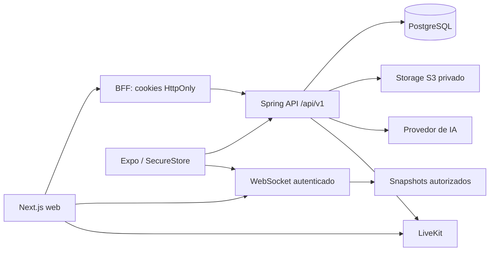

# Arquitetura

Monólito modular Java 21, Spring Boot 3.5, PostgreSQL, Flyway. Autenticação de usuários usa entidades JPA/repositórios; consultas transacionais de catálogo, salas e caronas usam JDBC parametrizado para tornar explícitos os locks e limites de autorização. Não são expostas entidades JPA nos controllers.

Módulos: auth emite e revoga sessões; academics mantém a árvore curricular; users gerencia matrícula; study controla salas/participantes; chat valida associação e persiste mensagens e anexos; voice fornece grants LiveKit para voz/câmera/tela; materials valida e armazena documentos; ai recupera chunks apenas da sala e integra a OpenAI Responses API; rides controla interesse/aceite; moderation aplica bloqueios e ações auditáveis. As dependências partem dos módulos consumidores para auth/common/study, sem dependência inversa do domínio para controllers ou SDKs.

Fronteiras externas: ObjectStorageService, VoiceProvider e AiProvider. EmailWorker processa outbox durável; envio SMTP ocorre após o commit que criou a conta. PushNotificationService, OAuth, filas de parsing e embeddings são extensões ainda não implementadas.

Tokens opacos foram escolhidos em vez de JWT para a API: cada chamada consulta a sessão, permitindo revogação imediata. JWT é usado exclusivamente no grant LiveKit. A infraestrutura inicial não depende de Redis. O WebSocket de chat é um relay em memória por instância. Ele não consulta nem grava mensagens no PostgreSQL. Antes de aumentar para várias réplicas, adicionar pub/sub que transporte somente envelopes cifrados e preserve a propriedade de o servidor não possuir a chave da sala.

O catálogo usa `academic_entry`, com tipos explícitos e hierarquia imutável: instituição → campus → curso → versão curricular → período → disciplina → tópico. A versão inicial representa ofertas de disciplina dentro da grade. Identidade canônica de disciplinas reutilizáveis em múltiplas grades e pré-requisitos ainda precisam de modelagem adicional.

## Aprendizagem

O módulo `learning` registra progresso por desafio, ledger idempotente de XP, nível e sequência. A UI Web combina desafios progressivos com missão diária. O ledger evita premiação duplicada mesmo com retries concorrentes.

## Integrações externas atuais

- OpenAI Responses API: tutor com materiais e pesquisa web opcional com citações.
- LiveKit: voz, câmera e compartilhamento de tela no Web.
- S3/R2/MinIO: materiais persistentes enviados explicitamente para estudo.
