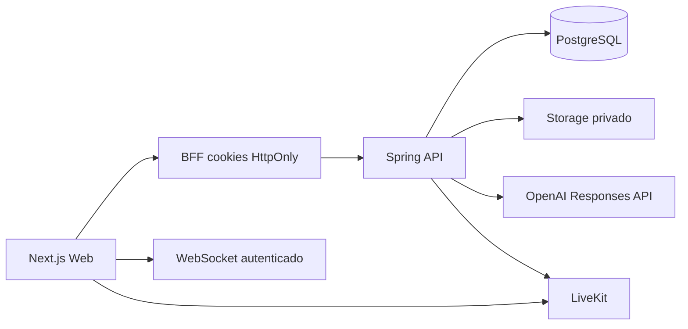

# Arquitetura

Enturma é um monólito modular com Java 21/Spring Boot, PostgreSQL/Flyway, Next.js e Expo.

## Módulos

- `auth`: sessões, rotação e revogação;
- `academics`: catálogo verificado;
- `users`: perfil/matrícula;
- `study`: salas, participantes, matching, histórico;
- `chat`: mensagens persistentes, reações e relay em tempo real;
- `voice`: grants LiveKit;
- `materials`: armazenamento e parsing de documentos;
- `ai`: tutor, recap de entrada tardia e estudo final;
- `learning`: minigames, XP e sequência;
- `rides`: caronas;
- `moderation`: bloqueios e ações administrativas.

## Dados da colaboração

V10 adiciona:

- `room_message`;
- `room_message_reaction`;
- `room_study_summary`.

A autorização do histórico é baseada em `room_participant`. Sessões encerradas continuam consultáveis por participantes não removidos.

## Interface

O Web usa uma shell global com modo claro/escuro e opção de acessibilidade persistidos em `localStorage`. A sala v4 usa navegação por canais e layout responsivo.

## Escala

O histórico não depende de memória, mas presença/WebSocket ainda é local à instância. Para múltiplas réplicas, adicionar Redis/pub-sub ou barramento equivalente para eventos de tempo real.
